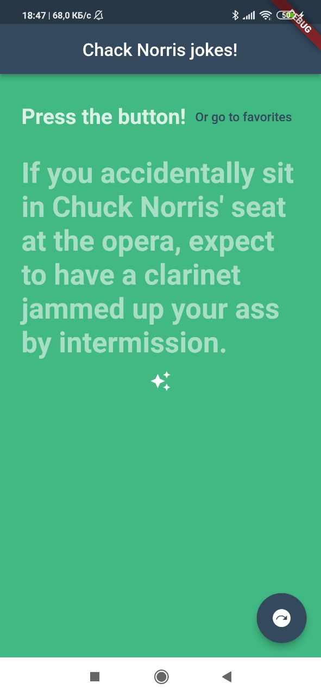
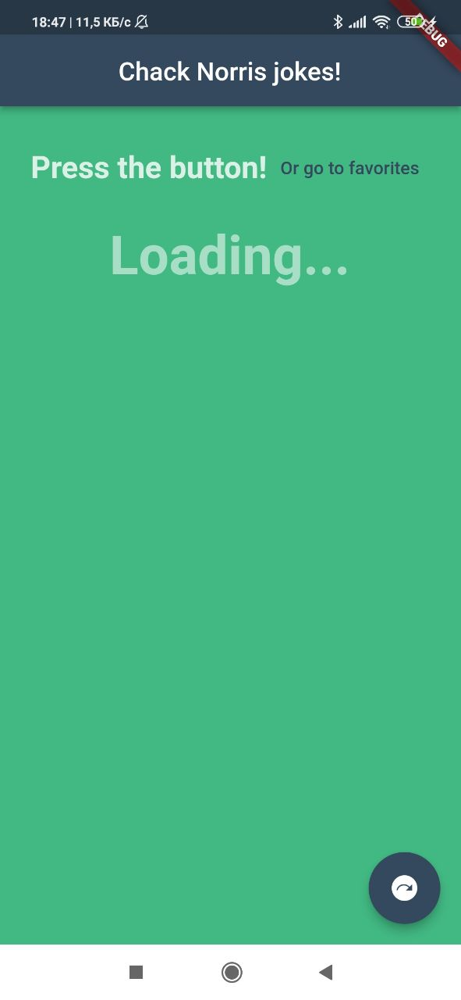
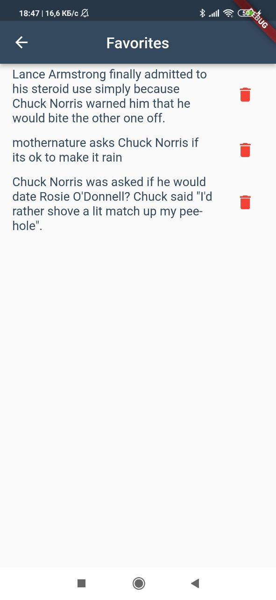
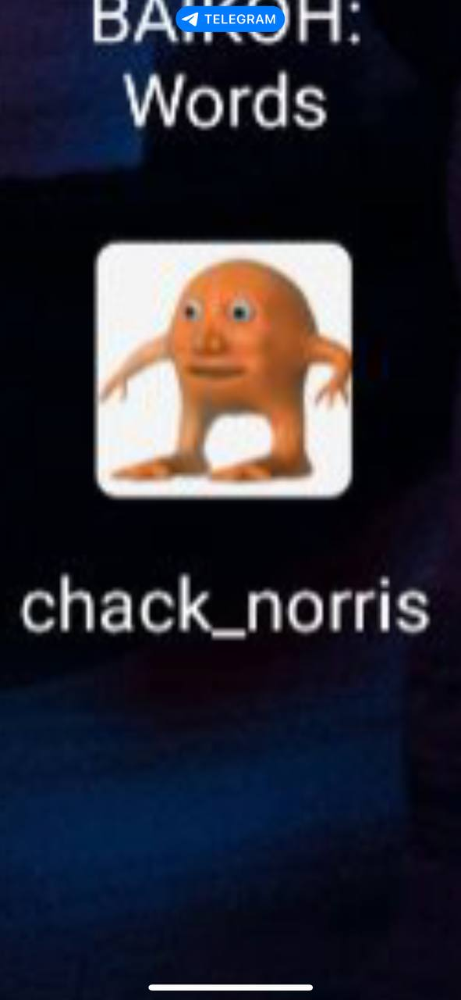

# Chack Norris Jokes

2nd Assignment for Flutter course of Innopolis University.

## Description

### Home view 
 - Contains a jokes that are fetched from chack norris api. 
 - To change joke, click on floating button at righ-bottom part of screen.
 - To add joke to favorites, click on stars icon, located under joke text, at the center. 
 - To see favorite jokes, click on 'Or go to favorites' button. It will navigate you to corresponding page.  

### Favorite jokes view
- Contains a list of favorite jokes
- User can delete any joke from favorites
- The favorite jokes are stored in device memory, so they will be able after reboting application

### Icon app
